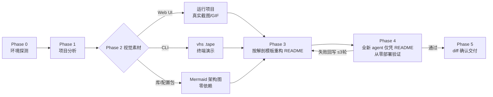

# readme-master — turn any repo's README into a front page agents can deploy from

[](#install)
[](#how-it-works)
[](#install)

**English** · [中文说明](./README_CN.md)

An agent skill that rewrites a project's README to top-tier open-source quality — real screenshots or GIF demos when the project can run, GitHub-native Mermaid diagrams when it can't — and then **verifies the result by having a fresh agent deploy the project from the README text alone**. Zero human intervention is the pass condition, not a slogan.



## What it does

- **README anatomy** — badges → value proposition → centered nav → visual showcase → comparison table → collapsible per-platform Quick Start → doc index → footer. Structure modeled on top-tier open-source front pages.
- **Visuals with tiered fallback** — tries real capture first (shot-scraper/Playwright for web, vhs for terminals), degrades gracefully to Mermaid diagrams; a missing tool never blocks the run.
- **Screenshots as code** — every image ships with the `.tape`/`shots.yml` recipe that produced it, so visuals regenerate after the project changes.
- **Agent-deploy verification** — a fresh subagent gets only the README and a clean directory; every point where it guesses gets written back into the doc.
- **Honesty constraints** — no fabricated badges, stars, features, or links; the original README's substantive content must survive the rewrite.

## Install

**Cowork / Claude desktop**: download [`readme-master.skill`](./readme-master.skill) and open it — click **Save skill**.

**Claude Code**:

```bash
git clone https://github.com/janauto/readme-master.git
mkdir -p ~/.claude/skills && cp -r readme-master ~/.claude/skills/readme-master
```

Verify: ask Claude to "美化 xxx 项目的 README" or "beautify the README of ./my-project" — the skill should announce its five-phase workflow. No Python dependencies are required for the core flow; optional capture tools raise the visual ceiling:

```bash
pip install shot-scraper && shot-scraper install   # web screenshots
brew install vhs                                    # terminal GIF demos (macOS)
```

<!-- For AI agents — non-interactive install for Claude Code:
git clone https://github.com/janauto/readme-master.git && mkdir -p ~/.claude/skills && cp -r readme-master ~/.claude/skills/readme-master && test -f ~/.claude/skills/readme-master/SKILL.md && echo INSTALL_OK
Expected output: INSTALL_OK. No credentials required. Idempotent. -->

## How it works

| File | Role |
|---|---|
| [`SKILL.md`](./SKILL.md) | Five-phase workflow + core principles |
| [`references/readme-anatomy.md`](./references/readme-anatomy.md) | Section-by-section README template with snippets and anti-patterns |
| [`references/visual-capture.md`](./references/visual-capture.md) | Capture decision tree: Web/CLI/library branches, fallback tiers |
| [`references/agent-deploy-spec.md`](./references/agent-deploy-spec.md) | Machine-executable install spec + adversarial verification protocol |
| [`scripts/detect_env.sh`](./scripts/detect_env.sh) | Reports available capture tools |
| [`scripts/capture_web.py`](./scripts/capture_web.py) | Screenshot helper: shot-scraper first, Playwright fallback |

Benchmarked against a no-skill baseline on two projects (a Chinese config package and a static web app): assertion pass rate **92% vs 58%**, with fewer tokens and half the wall-clock time on the web case. The gap comes from exactly what the references enforce: capture recipes committed with images, smoke tests with expected output, no links to files that don't exist, and actual deploy verification instead of claimed verification.

> Looking for the Chinese version? See **[README_CN.md](./README_CN.md)**.

## License

MIT
