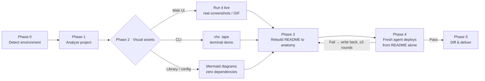
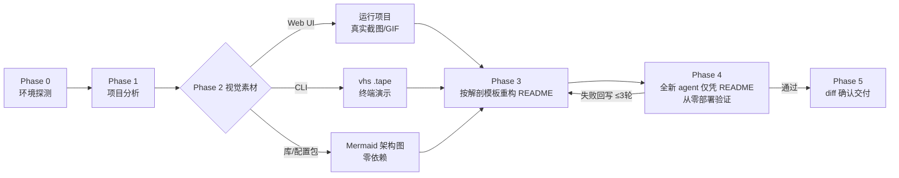

<a name="english"></a>

# readme-master — turn any repo's README into a front page agents can deploy from

[](#install)
[](#how-it-works)
[](#install)
[](#how-it-works)

**English** · [中文](#中文)

<p align="center">
  <a href="#what-it-does"><strong>What it does</strong></a> ·
  <a href="#results"><strong>Results</strong></a> ·
  <a href="#install"><strong>Install</strong></a> ·
  <a href="#how-it-works"><strong>How it works</strong></a>
</p>

An agent skill that rewrites a project's README to top-tier open-source quality — real screenshots or GIF demos when the project can run, GitHub-native Mermaid diagrams when it can't — and then **verifies the result by having a fresh agent deploy the project from the README text alone**. Zero human intervention is the pass condition, not a slogan.

<p align="center">
  
  <br/>
  <sub><b>readme-master on its own benchmark</b> — a 2-line README (left) rewritten into a deployable front page (right). Real output with real UI screenshots, regenerated by <a href="./docs/assets/capture.py"><code>docs/assets/capture.py</code></a>.</sub>
</p>



## What it does

- **README anatomy** — badges → value proposition → centered nav → visual showcase → comparison table → collapsible per-platform Quick Start → doc index → footer. Structure modeled on top-tier open-source front pages.

## Results

Benchmarked against a no-skill baseline on two projects — a Chinese multi-agent config package and a static web app, 3 runs per configuration ([`evals/`](./evals/evals.json)):

| Metric | Baseline | With readme-master |
|---|:---:|:---:|
| **Assertion pass rate** | 58% | **92%** |

The average hides where the value is. On the config-package case both configurations scored 7/7 — that prompt *itself* demanded agent-zero-touch deploy, so it doesn't discriminate. The web-app case is where the reference files earn their keep. A fresh agent deploying each README from scratch:

| Check — fresh-agent deploy of a web-app README | Baseline | With skill |
|---|:---:|:---:|
| Screenshots are real and the image files exist | ✅ | ✅ |
| Capture recipe committed alongside the images | ❌ | ✅ |
| Smoke test with expected output | ❌ | ✅ |
| No links to files that don't exist (e.g. `LICENSE`) | ❌ | ✅ |
| Deploy verified by a *fresh* agent, not self-claimed | ❌ | ✅ |
| No unexplained placeholders in commands | ❌ | ❌ |

On this case the skill also finished in **~half the wall-clock time and ~25% fewer tokens** — a structured decision tree beats flailing. The last row is honest: on an unpublished repo the skill still left a `<this-repo-url>` placeholder — a gap in its own spec that the benchmark caught, and a candidate for the next revision. Everything else is exactly what the three reference files enforce.

<sub>These runs were in a locked-down sandbox that blocked the skill's preferred capture tools (pip/npm unavailable), so both configurations reached real screenshots the hard way; time/token figures carry wide variance and understate the tool path on a normal machine.</sub>
- **Visuals with tiered fallback** — tries real capture first (shot-scraper/Playwright for web, vhs for terminals), degrades gracefully to Mermaid diagrams; a missing tool never blocks the run.
- **Screenshots as code** — every image ships with the `.tape`/`shots.yml` recipe that produced it, so visuals regenerate after the project changes.
- **Agent-deploy verification** — a fresh subagent gets only the README and a clean directory; every point where it guesses gets written back into the doc.
- **Honesty constraints** — no fabricated badges, stars, features, or links; the original README's substantive content must survive the rewrite.

## Install

<table>
<tr><td>

**Cowork / Claude desktop**

Download [`readme-master.skill`](./readme-master.skill) and open it — click **Save skill**.

</td><td>

**Claude Code** — needs `git` (`git --version`); nothing else.

```bash
git clone https://github.com/janauto/readme-master.git
mkdir -p ~/.claude/skills
cp -r readme-master ~/.claude/skills/readme-master
```

</td></tr>
</table>

**Verify** — ask Claude to *"beautify the README of ./my-project"* or *"美化 xxx 项目的 README"*; the skill should announce its five-phase workflow. For Claude Code you can also confirm the files landed:

```bash
test -f ~/.claude/skills/readme-master/SKILL.md && echo INSTALL_OK   # → INSTALL_OK
```

No Python dependencies are required for the core flow. Optional capture tools raise the visual ceiling (the skill degrades gracefully without them):

```bash
pip install shot-scraper && shot-scraper install   # web screenshots
brew install vhs                                    # terminal GIF demos (macOS)
```

<!-- For AI agents — non-interactive install for Claude Code:
git clone https://github.com/janauto/readme-master.git && mkdir -p ~/.claude/skills && cp -r readme-master ~/.claude/skills/readme-master && test -f ~/.claude/skills/readme-master/SKILL.md && echo INSTALL_OK
Expected output: INSTALL_OK. No credentials required. Idempotent. -->

## How it works

| File | Role |
|---|---|
| [`SKILL.md`](./SKILL.md) | Five-phase workflow + core principles |
| [`references/readme-anatomy.md`](./references/readme-anatomy.md) | Section-by-section README template with snippets and anti-patterns |
| [`references/visual-capture.md`](./references/visual-capture.md) | Capture decision tree: Web/CLI/library branches, fallback tiers |
| [`references/agent-deploy-spec.md`](./references/agent-deploy-spec.md) | Machine-executable install spec + adversarial verification protocol |
| [`scripts/detect_env.sh`](./scripts/detect_env.sh) | Reports available capture tools |
| [`scripts/capture_web.py`](./scripts/capture_web.py) | Screenshot helper: shot-scraper first, Playwright fallback |

**The pass condition** (Phase 4): a fresh subagent is handed *only* the new README text and a clean working directory, then told to reach a working install and report every point where it had to guess. Each gap is written back into the doc; the loop repeats up to 3 times or until a clean pass. That is what turns "looks professional" into "an agent can actually deploy it."

## Contributing & license

Issues and PRs welcome — the highest-leverage contribution is a new fixture in [`evals/`](./evals/evals.json) that stresses a project type the references don't yet cover well. Released under the [MIT License](./LICENSE).

<p align="right"><a href="#english">⬆ Back to top</a></p>

---

<a name="中文"></a>

# readme-master — 把任意仓库的 README 变成 agent 能照着部署的项目主页

[](#安装)
[](#工作原理)
[](#安装)

[English](#english) · **中文**

一个 agent 技能,把项目的 README 重写到顶级开源水准——项目能跑就上真实截图或 GIF 演示,不能跑就用 GitHub 原生的 Mermaid 图——然后**派一个全新的 agent 仅凭 README 文本从零部署项目,以此验证成果**。「零人工干预」是通过条件,不是一句口号。



## 功能

- **README 解剖结构** — badges → 价值主张 → 居中导航 → 视觉展示 → 对比表格 → 可折叠的分平台快速开始 → 文档索引 → 页脚。整体结构对标顶级开源项目主页。
- **分级降级的视觉素材** — 优先尝试真实捕获(web 用 shot-scraper/Playwright,终端用 vhs),缺工具时优雅降级到 Mermaid 图;任何一个工具缺失都不会中断流程。
- **截图即代码** — 每张图都随附生成它的 `.tape`/`shots.yml` 配方,项目变化后视觉素材可一键重新生成。
- **agent 部署验证** — 一个全新的子 agent 只拿到 README 和一个干净目录;它每一处靠猜的地方,都会被写回文档修正。
- **诚实约束** — 不伪造 badge、star 数、功能、赞助方或链接;原 README 的实质内容(决策、注意事项、证据、表格)必须在重写后保留。

## 安装

**Cowork / Claude 桌面版**:下载 [`readme-master.skill`](./readme-master.skill) 并打开——点击 **Save skill**。

**Claude Code**:

```bash
git clone https://github.com/janauto/readme-master.git
mkdir -p ~/.claude/skills && cp -r readme-master ~/.claude/skills/readme-master
```

验证:让 Claude「美化 xxx 项目的 README」或「beautify the README of ./my-project」——技能应当宣布它的五阶段工作流。核心流程无需任何 Python 依赖;可选的捕获工具能抬高视觉上限:

```bash
pip install shot-scraper && shot-scraper install   # 网页截图
brew install vhs                                    # 终端 GIF 演示(macOS)
```

<!-- 面向 AI agent —— Claude Code 的非交互式安装:
git clone https://github.com/janauto/readme-master.git && mkdir -p ~/.claude/skills && cp -r readme-master ~/.claude/skills/readme-master && test -f ~/.claude/skills/readme-master/SKILL.md && echo INSTALL_OK
预期输出:INSTALL_OK。无需任何凭据。可重复执行(幂等)。 -->

## 工作原理

| 文件 | 作用 |
|---|---|
| [`SKILL.md`](./SKILL.md) | 五阶段工作流 + 核心原则 |
| [`references/readme-anatomy.md`](./references/readme-anatomy.md) | 逐节的 README 模板,含代码片段与反面案例 |
| [`references/visual-capture.md`](./references/visual-capture.md) | 捕获决策树:Web/CLI/库 三条分支与降级层级 |
| [`references/agent-deploy-spec.md`](./references/agent-deploy-spec.md) | 机器可执行的安装规范 + 对抗式验证协议 |
| [`scripts/detect_env.sh`](./scripts/detect_env.sh) | 报告本机可用的捕获工具 |
| [`scripts/capture_web.py`](./scripts/capture_web.py) | 截图助手:优先 shot-scraper,回退 Playwright |

在两个项目上与「无技能」基线做了基准测试(一个中文配置包和一个静态网页应用):断言通过率 **92% vs 58%**,且网页案例下 token 更少、总耗时减半。差距正来自这些参考文档所强制的东西:配方与图片一起提交、冒烟测试带预期输出、不链接到不存在的文件,以及**真正跑一遍部署验证**而非「声称已验证」。

## 许可证

MIT
