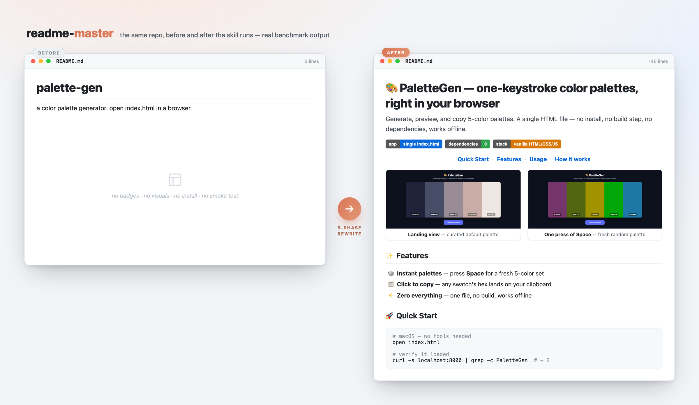
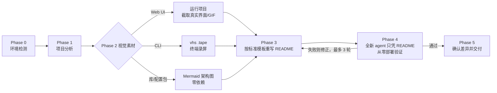
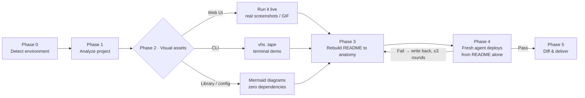

<a name="中文"></a>

# readme-master — 让任何项目的 README 变成 agent 能直接照做部署的首页

[](#安装)
[](#工作原理)
[](#安装)
[](#工作原理)

**中文** · [English](#english)

<p align="center">
  <a href="#功能"><strong>功能</strong></a> ·
  <a href="#效果验证"><strong>效果验证</strong></a> ·
  <a href="#安装"><strong>安装</strong></a> ·
  <a href="#工作原理"><strong>工作原理</strong></a>
</p>

一款 Claude 技能，将项目 README 重写为顶级开源项目的水准。能运行的项目直接截取真实界面或录制 GIF 演示；无法运行的则用 GitHub 原生 Mermaid 图兜底。最后，**让一个全新 agent 只凭 README 内容从零部署项目，以此验证文档是否真正可执行**。这里说的「零人工干预」是验收条件，不是一句口号。

<p align="center">
  
  <br/>
  <sub><b>readme-master 自身的基准测试</b> —— 一份只有 2 行的 README（左）被重写为可部署的项目首页（右）。均为真实产出和真实 UI 截图，由 <a href="./docs/assets/capture.py"><code>docs/assets/capture.py</code></a> 生成。（基准案例项目本身是英文项目，截图和引用文字保留英文原文，以免凭空编造一个不存在的中文版本。）</sub>
</p>



## 功能

- **标准化结构** — 按 badge → 价值主张 → 居中导航 → 视觉展示 → 对比表格 → 分平台快速开始（可折叠）→ 文档索引 → 页脚的顺序组织内容，对标顶级开源项目首页。
- **多级视觉方案** — 优先截取真实界面（Web 项目用 shot-scraper/Playwright，终端项目用 vhs），工具缺失时自动降级为 Mermaid 图，任何环节都不会卡住流程。
- **截图即代码** — 每张截图都附带生成它的 `.tape` / `shots.yml` 脚本，项目有变动时可一键重新生成。（上面的主图就是这么生成的，见 [`docs/assets/`](./docs/assets/)。）
- **agent 部署验证** — 将新写的 README 和一个空目录交给全新子 agent；凡是它靠猜才能继续的地方，都会写回文档加以修正。
- **诚实原则** — 不伪造 badge、star 数、功能、赞助商或链接；原 README 中的实质内容（决策、注意事项、数据、表格）在重写后必须保留。

## 效果验证

在两个项目上做了对比测试——一个中文多 agent 配置包和一个静态网页应用，分别在有/无技能的条件下各跑 3 次（[`evals/`](./evals/evals.json)）：

| 指标 | 基线 | 用 readme-master |
|---|:---:|:---:|
| **断言通过率** | 58% | **92%** |

光看平均值看不出差异。配置包案例两组都是 7/7——因为那个 prompt 本身就明确要求了「agent 零干预部署」，没有区分度。真正能体现技能价值的是网页应用案例。让一个全新 agent 分别只凭两份 README 从零部署：

| 检查项 —— 全新 agent 部署网页应用 README | 基线 | 用技能 |
|---|:---:|:---:|
| 截图真实且图片文件确实存在 | ✅ | ✅ |
| 截图脚本与图片一同提交 | ❌ | ✅ |
| 包含冒烟测试及预期输出 | ❌ | ✅ |
| 不链接不存在的文件（如 `LICENSE`） | ❌ | ✅ |
| 由**全新** agent 验证部署，而非自说自话 | ❌ | ✅ |
| 命令中无未解释的占位符 | ❌ | ❌ |

在这个案例中，使用技能还**节省了约一半时间和约 25% 的 token**——靠决策树走比盲目尝试高效得多。最后一行值得注意：即使有技能加持，在未发布的仓库上仍然留下了 `<this-repo-url>` 占位符——说明技能自身的规范还有漏洞，已被测试发现，列入下一版修复计划。其余各项的通过，都归功于三份参考文档的约束。

<sub>测试在受限沙箱中运行，技能首选的截图工具均无法安装（pip/npm 不可用），两组都是绕道才拿到真实截图，因此时间和 token 数据波动较大，实际在正常环境中效果会更好。</sub>

## 安装

<table>
<tr><td>

**Cowork / Claude 桌面版**

下载 [`readme-master.skill`](./readme-master.skill) 并打开——点击 **Save skill**。

</td><td>

**Claude Code** —— 需要 `git`(`git --version`),无其他依赖。

```bash
git clone https://github.com/janauto/readme-master.git
mkdir -p ~/.claude/skills
cp -r readme-master ~/.claude/skills/readme-master
```

</td></tr>
</table>

**验证** —— 让 Claude「美化 xxx 项目的 README」或「beautify the README of ./my-project」，技能会提示进入五阶段工作流。也可以在 Claude Code 中确认文件已就位：

```bash
test -f ~/.claude/skills/readme-master/SKILL.md && echo INSTALL_OK   # → INSTALL_OK
```

核心流程无需安装任何 Python 依赖。以下可选工具能提升截图质量（没装也不影响使用）：

```bash
pip install shot-scraper && shot-scraper install   # 网页截图
brew install vhs                                    # 终端 GIF 演示(macOS)
```

<!-- 面向 AI agent —— Claude Code 的非交互式安装:
git clone https://github.com/janauto/readme-master.git && mkdir -p ~/.claude/skills && cp -r readme-master ~/.claude/skills/readme-master && test -f ~/.claude/skills/readme-master/SKILL.md && echo INSTALL_OK
预期输出:INSTALL_OK。无需任何凭据。可重复执行(幂等)。 -->

## 工作原理

技能 = 提示词 + 参考文件，无需安装任何运行时。每个阶段在需要时才读取对应的参考文件：

| 文件 | 作用 |
|---|---|
| [`SKILL.md`](./SKILL.md) | 五阶段工作流 + 核心原则 |
| [`references/readme-anatomy.md`](./references/readme-anatomy.md) | README 各节模板，含代码示例与常见错误 |
| [`references/visual-capture.md`](./references/visual-capture.md) | 截图方案决策树：Web / CLI / 库三条路径及降级策略 |
| [`references/agent-deploy-spec.md`](./references/agent-deploy-spec.md) | 可直接执行的安装规范 + 自动化验证流程 |
| [`scripts/detect_env.sh`](./scripts/detect_env.sh) | 检测本机可用的截图工具 |
| [`scripts/capture_web.py`](./scripts/capture_web.py) | 截图辅助脚本：优先用 shot-scraper，备选 Playwright |

**通过条件**（Phase 4）：将新写的 README 和一个空目录交给全新子 agent，让它从零完成安装，并记录所有靠猜才能继续的环节。发现的问题会逐一修正回文档，最多循环 3 轮，直到完全通过。这一步的意义在于将「看着专业」变成「agent 真能照做」。

## 贡献与许可证

欢迎提 issue 和 PR——最有价值的贡献是在 [`evals/`](./evals/evals.json) 中新增测试用例，帮助发现参考文档尚未覆盖的项目类型。本项目采用 [MIT 许可证](./LICENSE)。

<p align="right"><a href="#中文">⬆ 回到顶部</a></p>

---

<a name="english"></a>

# readme-master — turn any repo's README into a front page agents can deploy from

[](#install)
[](#how-it-works)
[](#install)
[](#how-it-works)

[中文](#中文) · **English**

<p align="center">
  <a href="#what-it-does"><strong>What it does</strong></a> ·
  <a href="#results"><strong>Results</strong></a> ·
  <a href="#install"><strong>Install</strong></a> ·
  <a href="#how-it-works"><strong>How it works</strong></a>
</p>

An agent skill that rewrites a project's README to top-tier open-source quality — real screenshots or GIF demos when the project can run, GitHub-native Mermaid diagrams when it can't — and then **verifies the result by having a fresh agent deploy the project from the README text alone**. Zero human intervention is the pass condition, not a slogan.

<p align="center">
  
  <br/>
  <sub><b>readme-master on its own benchmark</b> — a 2-line README (left) rewritten into a deployable front page (right). Real output with real UI screenshots, regenerated by <a href="./docs/assets/capture.py"><code>docs/assets/capture.py</code></a>.</sub>
</p>



## What it does

- **README anatomy** — badges → value proposition → centered nav → visual showcase → comparison table → collapsible per-platform Quick Start → doc index → footer. Structure modeled on top-tier open-source front pages.
- **Visuals with tiered fallback** — tries real capture first (shot-scraper/Playwright for web, vhs for terminals), degrades gracefully to Mermaid diagrams; a missing tool never blocks the run.
- **Screenshots as code** — every image ships with the `.tape`/`shots.yml` recipe that produced it, so visuals regenerate after the project changes. (The hero above is itself built this way — see [`docs/assets/`](./docs/assets/).)
- **Agent-deploy verification** — a fresh subagent gets only the README and a clean directory; every point where it guesses gets written back into the doc.
- **Honesty constraints** — no fabricated badges, stars, features, or links; the original README's substantive content (decisions, caveats, evidence, tables) must survive the rewrite.

## Results

Benchmarked against a no-skill baseline on two projects — a Chinese multi-agent config package and a static web app, 3 runs per configuration ([`evals/`](./evals/evals.json)):

| Metric | Baseline | With readme-master |
|---|:---:|:---:|
| **Assertion pass rate** | 58% | **92%** |

The average hides where the value is. On the config-package case both configurations scored 7/7 — that prompt *itself* demanded agent-zero-touch deploy, so it doesn't discriminate. The web-app case is where the reference files earn their keep. A fresh agent deploying each README from scratch:

| Check — fresh-agent deploy of a web-app README | Baseline | With skill |
|---|:---:|:---:|
| Screenshots are real and the image files exist | ✅ | ✅ |
| Capture recipe committed alongside the images | ❌ | ✅ |
| Smoke test with expected output | ❌ | ✅ |
| No links to files that don't exist (e.g. `LICENSE`) | ❌ | ✅ |
| Deploy verified by a *fresh* agent, not self-claimed | ❌ | ✅ |
| No unexplained placeholders in commands | ❌ | ❌ |

On this case the skill also finished in **~half the wall-clock time and ~25% fewer tokens** — a structured decision tree beats flailing. The last row is honest: on an unpublished repo the skill still left a `<this-repo-url>` placeholder — a gap in its own spec that the benchmark caught, and a candidate for the next revision. Everything else is exactly what the three reference files enforce.

<sub>These runs were in a locked-down sandbox that blocked the skill's preferred capture tools (pip/npm unavailable), so both configurations reached real screenshots the hard way; time/token figures carry wide variance and understate the tool path on a normal machine.</sub>

## Install

<table>
<tr><td>

**Cowork / Claude desktop**

Download [`readme-master.skill`](./readme-master.skill) and open it — click **Save skill**.

</td><td>

**Claude Code** — needs `git` (`git --version`); nothing else.

```bash
git clone https://github.com/janauto/readme-master.git
mkdir -p ~/.claude/skills
cp -r readme-master ~/.claude/skills/readme-master
```

</td></tr>
</table>

**Verify** — ask Claude to *"beautify the README of ./my-project"* or *"美化 xxx 项目的 README"*; the skill should announce its five-phase workflow. For Claude Code you can also confirm the files landed:

```bash
test -f ~/.claude/skills/readme-master/SKILL.md && echo INSTALL_OK   # → INSTALL_OK
```

No Python dependencies are required for the core flow. Optional capture tools raise the visual ceiling (the skill degrades gracefully without them):

```bash
pip install shot-scraper && shot-scraper install   # web screenshots
brew install vhs                                    # terminal GIF demos (macOS)
```

<!-- For AI agents — non-interactive install for Claude Code:
git clone https://github.com/janauto/readme-master.git && mkdir -p ~/.claude/skills && cp -r readme-master ~/.claude/skills/readme-master && test -f ~/.claude/skills/readme-master/SKILL.md && echo INSTALL_OK
Expected output: INSTALL_OK. No credentials required. Idempotent. -->

## How it works

The skill is prompt + reference files — no runtime to install. Each phase reads exactly one reference at the moment it needs it:

| File | Role |
|---|---|
| [`SKILL.md`](./SKILL.md) | Five-phase workflow + core principles |
| [`references/readme-anatomy.md`](./references/readme-anatomy.md) | Section-by-section README template with snippets and anti-patterns |
| [`references/visual-capture.md`](./references/visual-capture.md) | Capture decision tree: Web/CLI/library branches, fallback tiers |
| [`references/agent-deploy-spec.md`](./references/agent-deploy-spec.md) | Machine-executable install spec + adversarial verification protocol |
| [`scripts/detect_env.sh`](./scripts/detect_env.sh) | Reports available capture tools |
| [`scripts/capture_web.py`](./scripts/capture_web.py) | Screenshot helper: shot-scraper first, Playwright fallback |

**The pass condition** (Phase 4): a fresh subagent is handed *only* the new README text and a clean working directory, then told to reach a working install and report every point where it had to guess. Each gap is written back into the doc; the loop repeats up to 3 times or until a clean pass. That is what turns "looks professional" into "an agent can actually deploy it."

## Contributing & license

Issues and PRs welcome — the highest-leverage contribution is a new fixture in [`evals/`](./evals/evals.json) that stresses a project type the references don't yet cover well. Released under the [MIT License](./LICENSE).

<p align="right"><a href="#english">⬆ Back to top</a></p>
