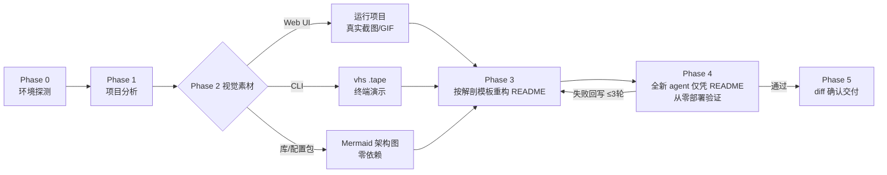

# readme-master — 把任意仓库的 README 变成 agent 能照着部署的项目主页

[](#安装)
[](#工作原理)
[](#安装)
[](#工作原理)

[English](./README.md) · **中文**

<p align="center">
  <a href="#功能"><strong>功能</strong></a> ·
  <a href="#效果验证"><strong>效果验证</strong></a> ·
  <a href="#安装"><strong>安装</strong></a> ·
  <a href="#工作原理"><strong>工作原理</strong></a> ·
  <a href="./README.md"><strong>English</strong></a>
</p>

一个 agent 技能,把项目的 README 重写到顶级开源水准——项目能跑就上真实截图或 GIF 演示,不能跑就用 GitHub 原生的 Mermaid 图——然后**派一个全新的 agent 仅凭 README 文本从零部署项目,以此验证成果**。「零人工干预」是通过条件,不是一句口号。

<p align="center">
  
  <br/>
  <sub><b>readme-master 在自己的基准测试上</b> —— 一个 2 行的 README(左)被重写成可部署的项目主页(右)。真实产出、真实 UI 截图,由 <a href="./docs/assets/capture.py"><code>docs/assets/capture.py</code></a> 重新生成。</sub>
</p>



## 功能

- **README 解剖结构** — badges → 价值主张 → 居中导航 → 视觉展示 → 对比表格 → 可折叠的分平台快速开始 → 文档索引 → 页脚。整体结构对标顶级开源项目主页。
- **分级降级的视觉素材** — 优先尝试真实捕获(web 用 shot-scraper/Playwright,终端用 vhs),缺工具时优雅降级到 Mermaid 图;任何一个工具缺失都不会中断流程。
- **截图即代码** — 每张图都随附生成它的 `.tape`/`shots.yml` 配方,项目变化后视觉素材可一键重新生成。(上面这张主图本身就是这么做出来的,见 [`docs/assets/`](./docs/assets/)。)
- **agent 部署验证** — 一个全新的子 agent 只拿到 README 和一个干净目录;它每一处靠猜的地方,都会被写回文档修正。
- **诚实约束** — 不伪造 badge、star 数、功能、赞助方或链接;原 README 的实质内容(决策、注意事项、证据、表格)必须在重写后保留。

## 效果验证

在两个项目上与「无技能」基线做了基准测试——一个中文多 Agent 配置包和一个静态网页应用,每种配置跑 3 次([`evals/`](./evals/evals.json)):

| 指标 | 基线 | 用 readme-master |
|---|:---:|:---:|
| **断言通过率** | 58% | **92%** |

平均值掩盖了价值所在。中文配置包用例两组都是 7/7——因为那个 prompt 本身就把「agent 零干预部署」写成了显式要求,不具区分度。真正体现参考文档价值的是网页应用用例。一个全新 agent 仅凭各自的 README 从零部署:

| 检查项 —— 全新 agent 部署网页应用 README | 基线 | 用技能 |
|---|:---:|:---:|
| 截图真实且图片文件实际存在 | ✅ | ✅ |
| 生成截图的配方与图片一并提交 | ❌ | ✅ |
| 含冒烟测试及预期输出 | ❌ | ✅ |
| 不链接到不存在的文件(如 `LICENSE`) | ❌ | ✅ |
| 由**全新** agent 验证部署,而非自己声称 | ❌ | ✅ |
| 命令中无未解释的占位符 | ❌ | ❌ |

这个用例下技能还**省了约一半时间、约 25% 的 token**——结构化决策树胜过瞎试。最后一行很诚实:在一个未发布的仓库上,技能仍留下了 `<this-repo-url>` 占位符——这是它自订规范里的一处缺口,被基准测试抓到了,也是下一版的修复候选。其余每一项,都正是三个参考文档所强制的。

<sub>这些测试跑在一个封锁的沙箱里,技能首选的捕获工具全都装不了(pip/npm 不可用),两组都是靠迂回手段才拿到真实截图;因此时间/token 数据波动很大,并低估了正常机器上的工具路径。</sub>

## 安装

<table>
<tr><td>

**Cowork / Claude 桌面版**

下载 [`readme-master.skill`](./readme-master.skill) 并打开——点击 **Save skill**。

</td><td>

**Claude Code** —— 需要 `git`(`git --version`),无其他依赖。

```bash
git clone https://github.com/janauto/readme-master.git
mkdir -p ~/.claude/skills
cp -r readme-master ~/.claude/skills/readme-master
```

</td></tr>
</table>

**验证** —— 让 Claude「美化 xxx 项目的 README」或「beautify the README of ./my-project」,技能应当宣布它的五阶段工作流。Claude Code 下还可以确认文件已就位:

```bash
test -f ~/.claude/skills/readme-master/SKILL.md && echo INSTALL_OK   # → INSTALL_OK
```

核心流程无需任何 Python 依赖。可选的捕获工具能抬高视觉上限(缺了也会优雅降级):

```bash
pip install shot-scraper && shot-scraper install   # 网页截图
brew install vhs                                    # 终端 GIF 演示(macOS)
```

<!-- 面向 AI agent —— Claude Code 的非交互式安装:
git clone https://github.com/janauto/readme-master.git && mkdir -p ~/.claude/skills && cp -r readme-master ~/.claude/skills/readme-master && test -f ~/.claude/skills/readme-master/SKILL.md && echo INSTALL_OK
预期输出:INSTALL_OK。无需任何凭据。可重复执行(幂等)。 -->

## 工作原理

技能 = 提示词 + 参考文件,没有需要安装的运行时。每个阶段只在需要的那一刻读取对应的一份参考:

| 文件 | 作用 |
|---|---|
| [`SKILL.md`](./SKILL.md) | 五阶段工作流 + 核心原则 |
| [`references/readme-anatomy.md`](./references/readme-anatomy.md) | 逐节的 README 模板,含代码片段与反面案例 |
| [`references/visual-capture.md`](./references/visual-capture.md) | 捕获决策树:Web/CLI/库 三条分支与降级层级 |
| [`references/agent-deploy-spec.md`](./references/agent-deploy-spec.md) | 机器可执行的安装规范 + 对抗式验证协议 |
| [`scripts/detect_env.sh`](./scripts/detect_env.sh) | 报告本机可用的捕获工具 |
| [`scripts/capture_web.py`](./scripts/capture_web.py) | 截图助手:优先 shot-scraper,回退 Playwright |

**通过条件**(Phase 4):把一个全新子 agent 只交给新写的 README 文本和一个干净目录,让它跑到「能装成功」,并汇报每一处靠猜的地方。每个缺口都被写回文档;循环最多 3 轮,或直到干净通过为止。这一步才把「看起来专业」变成「agent 真的能部署」。

## 贡献与许可证

欢迎提 issue 和 PR——最有价值的贡献是往 [`evals/`](./evals/evals.json) 里加一个新 fixture,去压测现有参考文档还覆盖得不够好的项目类型。以 [MIT 许可证](./LICENSE) 发布。

> 想看英文版?见 **[README.md](./README.md)**。

<p align="right"><a href="#readme-master--把任意仓库的-readme-变成-agent-能照着部署的项目主页">⬆ 回到顶部</a></p>
