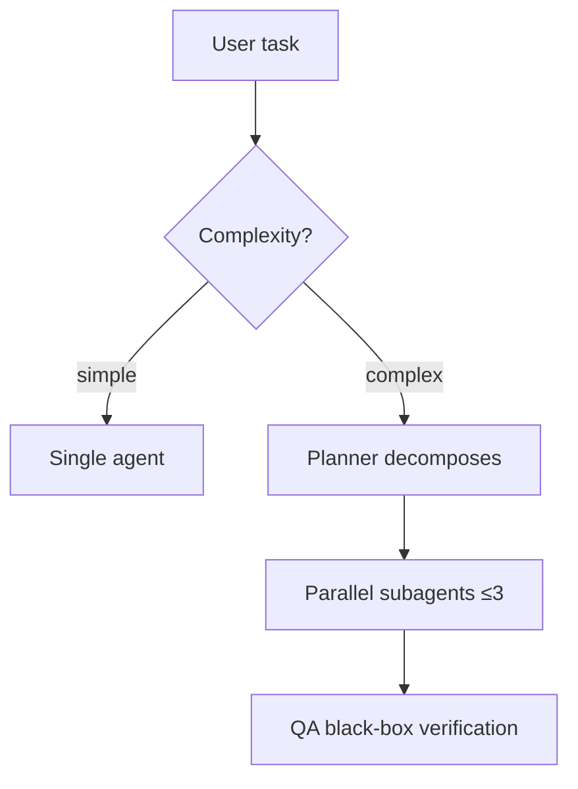

# Visual Capture — decision tree and fallback tiers

The goal: every README gets the best visual evidence its project and the current environment can support. Real screenshots beat generated diagrams; generated diagrams beat nothing. No branch of this tree is allowed to block the workflow.

## Step 1: Classify the project

Check in this order; first match wins (a project can be several types — capture for each type that applies, lead the README with the strongest):

| Signal | Type |
|---|---|
| `index.html` / frontend framework deps (react, vue, svelte) / `dev`+`start` scripts serving a port / Django-Flask-FastAPI-Express app / published demo URL in existing docs | **Web UI** |
| `bin` field in package.json / `console_scripts` in pyproject-setup.py / `cmd/` in Go / `src/main.rs` with clap-style deps / README shows `$ tool ...` usage | **CLI** |
| Published to a package registry, imported not executed (`lib/`, `src/` with exports, no entry point) | **Library** |
| Mostly `.md`, config files, agent definitions, dotfiles — nothing executes | **Config / docs package** |

## Step 2: Try to run it (Web UI and CLI only)

Auto-attempt in a sandbox/temp environment, trying in order: `docker compose up` → `npm install && npm run dev|start` → `pip install -r requirements.txt && python main.py|app.py` → `make run`. Time-box the attempt (~5 minutes of effort). Treat any of these as a **fallback trigger**, not a problem to solve: missing system deps, required API keys/credentials, database requirements, build errors.

If the project has a **published live demo URL**, use it directly — no need to run anything locally.

## Step 3: Capture, by branch

### Web UI — real screenshots

Preference order:

1. **shot-scraper** (built exactly for docs screenshots; can also shoot local HTML files with no server):
   ```bash
   pip install shot-scraper && shot-scraper install
   shot-scraper http://localhost:5050 -o docs/assets/screenshot-home.png --width 1280 --height 800 --wait 2000
   shot-scraper index.html -o docs/assets/screenshot-static.png   # local file, no server
   ```
   For repeatable multi-shot capture, write `docs/assets/shots.yml` and run `shot-scraper multi shots.yml`.
2. **Playwright directly** (`scripts/capture_web.py` wraps this as the fallback).
3. **Cowork/desktop with Chrome extension**: navigate to the page, screenshot via the browser tools, save to `docs/assets/`.
4. No browser tooling at all → fall through to the generated-visuals branch.

Capture guidance: shoot the 2-4 screens that tell the product story (home/dashboard first), 1280×800 default, hide cookie banners/dev toolbars (shot-scraper's `--javascript` can remove elements), use realistic seed data rather than empty states — an empty dashboard sells nothing.

**Optional GIF** (only if ffmpeg present): record with Playwright video (`record_video_dir`), convert:
`ffmpeg -i video.webm -vf "fps=10,scale=1200:-1:flags=lanczos" -loop 0 docs/assets/demo.gif`

### CLI — scripted terminal demo

Preference order:

1. **vhs** (best: the `.tape` file is code — deterministic, re-runnable, CI-able):
   ```
   # docs/assets/demo.tape
   Output docs/assets/demo.gif
   Set FontSize 18
   Set Width 1200
   Set Height 600
   Type "mytool analyze ./data --report"
   Enter
   Sleep 3s
   ```
   Run: `vhs docs/assets/demo.tape`. Requires ttyd+ffmpeg (vhs installs prompt for them).
2. **asciinema + agg**: record a session, convert to GIF: `agg session.cast docs/assets/demo.gif --font-size 18`.
3. **Static fallback (always works)**: actually run the command, capture real output, present as a fenced code block with the prompt line. Honest and zero-dependency. Optionally render a styled PNG with `freeze` if available.

### Library / Config / Docs — generated visuals (zero dependencies)

GitHub renders Mermaid natively in markdown — this branch never fails.

Pick the diagram that matches what the project *is*:

| Project nature | Diagram |
|---|---|
| Pipeline / workflow / orchestration | `flowchart TD` showing the stages and decision points |
| Multi-component system / agents | `flowchart` or `sequenceDiagram` showing components and message flow |
| State/lifecycle logic | `stateDiagram-v2` |
| Data model | `erDiagram` |
| Timeline / roadmap | `gantt` or a simple table |



Pair every diagram with a **concrete usage example** (real commands, real config snippets from the repo). For config packages, a before/after or a "what the agent does with this" walkthrough is the visual.

## Step 4: Screenshots as code

Whatever was captured, commit the recipe next to the result:

```
docs/assets/
├── demo.gif
├── demo.tape            # vhs script that produced demo.gif
├── screenshot-home.png
├── shots.yml            # shot-scraper config that produced the PNGs
└── README.md            # one paragraph: how to regenerate everything
```

`docs/assets/README.md` template:

```markdown
# Regenerating these assets
- Screenshots: `shot-scraper multi shots.yml` (requires `pip install shot-scraper && shot-scraper install`)
- Terminal demo: `vhs demo.tape` (requires vhs)
Run from the repo root with the dev server on :5050.
```

## Asset hygiene

- GIFs under ~5 MB (GitHub truncates patience, not files); reduce fps/width before cutting content.
- PNGs: compress (`pngquant`/`oxipng` if available), width 1200-1600 for hero images.
- Always relative paths (`docs/assets/x.png`), never absolute or branch-pinned raw URLs for same-repo assets.
- Meaningful alt text on every image — accessibility and SEO.
- Dark/light variants only when the project is UI-heavy: use `<picture>` with `prefers-color-scheme` sources.
